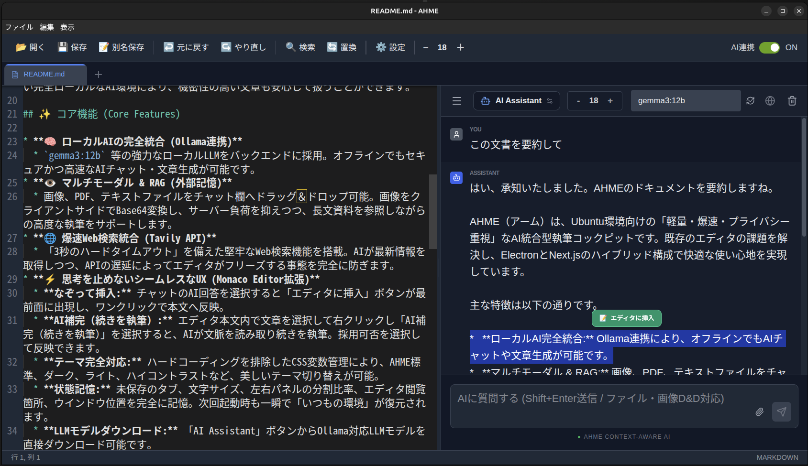

# AHME (AI Hybrid Minimal Editor)


AHME（読み方：アーム）は、「軽量・爆速・プライバシー重視」の哲学に基づいて開発された、ローカルAI統合型の究極の執筆コックピットです。
ElectronとNext.jsのハイブリッド構成により、ネイティブアプリの軽快さとWeb技術の柔軟性を両立し、思考を一切止めないシームレスなUI/UXを実現しています。

 ## 📖 開発背景 (Background)

Ubuntu 24.04環境において、「直感的に使いやすく、かつ痒い所に手が届く」テキストエディタが見当たらなかったことが開発の出発点です。
既存のGNOME Text Editorは日本語IMEとの相性（二重入力問題）があり、geditは未保存タブの記憶ができないといった課題がありました。

また、当初はTauriベースでの開発を試みましたが、Ubuntuの標準IME（Mozc）におけるインライン入力の不具合を解消できず、最終的に入力周りが極めて安定している **Electron** へとアーキテクチャを切り替えることで、完璧なタイピング体験を実現しています。

**モダンなAI開発アプローチ**
本プロジェクトは、自律型AIコーディングエージェント「Antigravity (Opus 4.6)」に初期の大枠（スキャフォールディング）を任せ、その後「Gemini 3.1 Pro」を監修者として対話しながら、手作業で複雑な機能追加やUIの微細なチューニング（Monaco Editorの徹底的なカスタマイズ等）を行うという、現代的なAIペアプログラミング手法によって構築されました。

純粋なコーディングエディタとしても機能しますが、主眼は**「論文の骨子作成」や「アイデアのメモ書き」といった執筆活動**に置いています。クラウドLLMに依存しない完全ローカルなAI環境により、機密性の高い文章も安心して扱うことができます。

## ✨ コア機能 (Core Features)

* **🧠 ローカルAIの完全統合 (Ollama連携)**
  * `gemma3:12b` 等の強力なローカルLLMをバックエンドに採用。オフラインでもセキュアかつ高速なAIチャット・文章生成が可能です。
* **👁️ マルチモーダル & RAG (外部記憶)**
  * 画像、PDF、テキストファイルをチャット欄へドラッグ＆ドロップ可能。画像をクライアントサイドでBase64変換し、サーバー負荷を抑えつつ、長文資料を参照しながらの高度な執筆をサポートします。
* **🌐 爆速Web検索統合 (Tavily API)**
  * 「3秒のハードタイムアウト」を備えた堅牢なWeb検索機能を搭載。AIが最新情報を取得しつつ、APIの遅延によってエディタがフリーズする事態を完全に防ぎます。
* **⚡ 思考を止めないシームレスなUX (Monaco Editor拡張)**
  * **なぞって挿入:** チャットのAI回答を選択すると「エディタに挿入」ボタンが最前面に出現し、ワンクリックで本文へ反映。
  * **AI補完（続きを執筆）:** エディタ本文内で文章を選択して右クリックし「AI補完（続きを執筆）」を選択すると、AIが文脈を読み取り続きを執筆。採用可否を選択して反映できます。
  * **テーマ完全対応:** ハードコーディングを排除したCSS変数管理により、AHME標準、ダーク、ライト、ハイコントラストなど、美しいテーマ切り替えが可能。
  * **状態記憶:** 未保存のタブ、文字サイズ、左右パネルの分割比率、エディタ閲覧箇所、ウインドウ位置を完全に記憶。次回起動時も一瞬で「いつもの環境」が復元されます。
  * **LLMモデルダウンロード:** 「AI Assistant」ボタンからOllama対応LLMモデルを直接ダウンロード可能です。
  * **チャット履歴:** AIとのチャット履歴も保存されます（チャットとファイルとの紐付け表示あり）。

## 💻 動作環境 (Environment)

* **OS:** Ubuntu 24.04.3 LTS / Ubuntu 24.04.4 LTS
  *(※ Windows, macOS 環境での動作確認は行っておりません)*
* **必須要件:** * Node.js (v18以上推奨)
  * Ollama (AI機能を利用する場合必須)

## 🛠️ 技術スタック (Tech Stack)

* **フロントエンド:** Next.js (App Router), React, Tailwind CSS (v4)
* **エディタエンジン:** Monaco Editor (`@monaco-editor/react`)
* **バックエンド / デスクトップ:** Electron (IPC通信によるセキュアなウィンドウ制御)
* **AI・検索API:** Ollama (ローカルLLM), Tavily Search API

## 📂 ディレクトリ構成 (Directory Structure)

```text
ahme/
├── app/                  # Next.js App Router (ページ、CSS、APIルート)
├── components/           # Reactコンポーネント (Header, Editor, Settings等)
├── components/config/    # 設定ファイル・定数管理 (constants.ts)
├── public/               # 静的アセット (アイコン画像等)
├── main.js               # Electron メインプロセス
├── preload.js            # Electron プリロードスクリプト (セキュアなIPC通信)
├── package.json          # 依存関係と起動スクリプト
└── .env.local            # 環境変数 (※Git管理外)

🚀 セットアップと起動 (Setup & Run)

1. 前提条件の準備
Ollamaがインストールされ、対象のモデル（デフォルトでは gemma3:12b）がプルされていることを確認してください。
ollama run gemma3:12b

2. リポジトリのクローンとインストール
git clone [https://github.com/rareln/ahme.git](https://github.com/rareln/ahme.git)
cd ahme
npm install

3. 環境変数の設定 (.env.local)
プロジェクトのルートディレクトリに .env.local ファイルを作成し、必要なAPIキーを設定します。
※注意: .env.local には機密情報が含まれるため、絶対にGitへコミット（公開）しないでください。

# OllamaのAPI URL（デフォルト）
OLLAMA_API_URL=http://localhost:11434

# Web検索を使用する場合のTavily APIキー
TAVILY_API_KEY=tvly-your_api_key_here

4. 開発モードでの起動
Next.jsのローカルサーバーとElectronプロセスを同時に起動します。
npm run dev:all

📝 利用上の注意事項 (Notes)
本ソフトウェアは、個人的な執筆環境の最適化を目的として開発されたものです。予期せぬバグが発生する可能性がありますので、重要なデータは定期的にバックアップを取ることをお勧めします。

📄 ライセンス (License)
Copyright (c) 2026 rareln
Released under the MIT license
https://opensource.org/licenses/mit-license.php